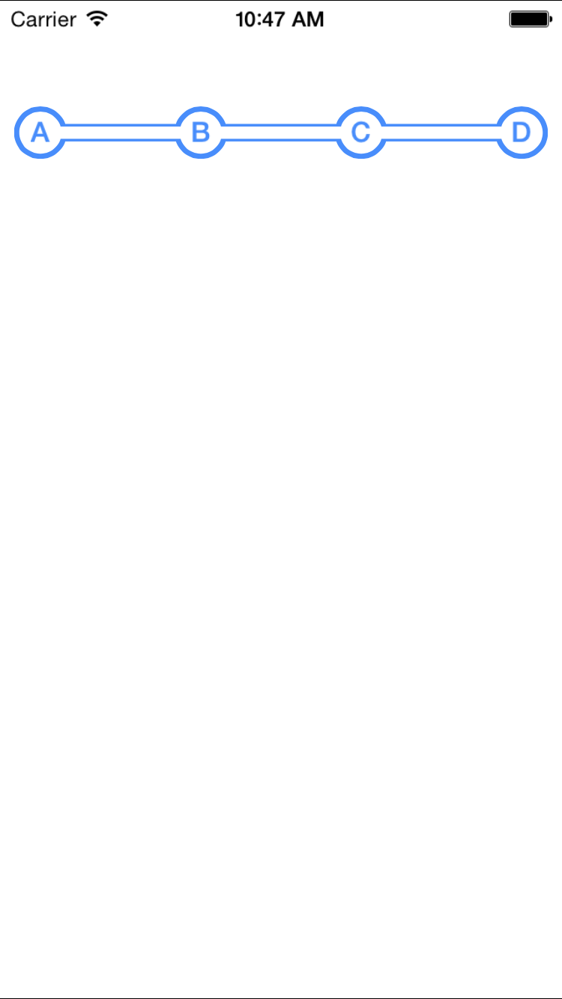

# HaidoraStepProgressView

[](https://travis-ci.org/mrdaios/HaidoraStepProgressView)
[](http://cocoapods.org/pods/HaidoraStepProgressView)
[](http://cocoapods.org/pods/HaidoraStepProgressView)
[](http://cocoapods.org/pods/HaidoraStepProgressView)

## Usage


To run the example project, clone the repo, and run `pod install` from the Example directory first.

## Requirements

## Installation

HaidoraStepProgressView is available through [CocoaPods](http://cocoapods.org). To install
it, simply add the following line to your Podfile:

```ruby
pod "HaidoraStepProgressView"
```

## Author

mrdaios, mrdaios@gmail.com

## License

HaidoraStepProgressView is available under the MIT license. See the LICENSE file for more info.
